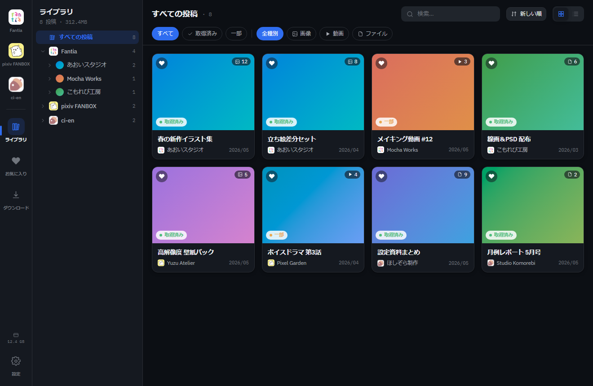
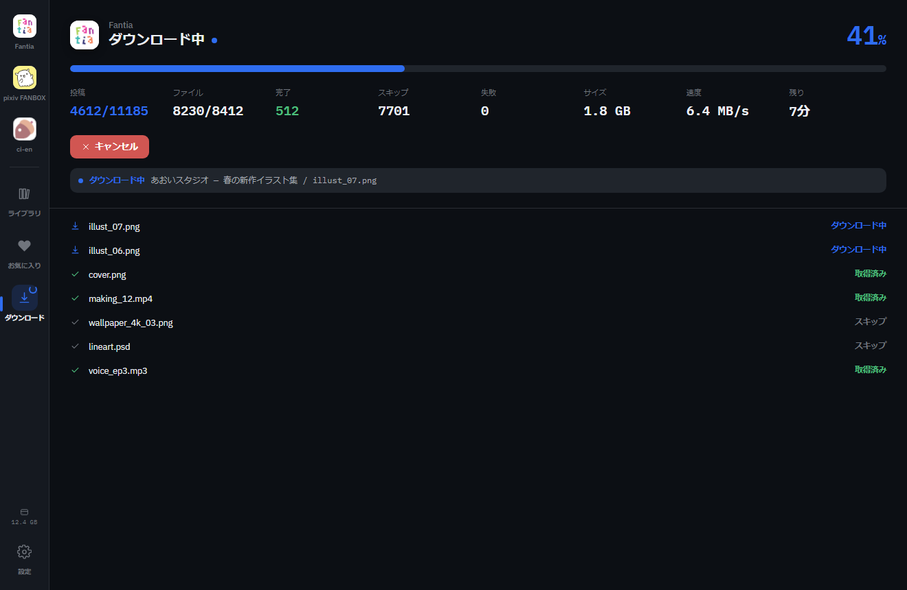

# fc-downloader

**Fantia / pixiv FANBOX / Patreon / ci-en** で支援しているコンテンツを、
**自分の PC にまとめてダウンロードして閲覧**できるデスクトップアプリです。

  

> 上の画面はサンプル（モック）データです。

---

## 何ができる？

- 🔒 **すべて自分の PC の中だけ** — ダウンロードしたファイルは外部に送信されません。
- 🧩 **いつものログインだけ** — アプリ内のブラウザで各サイトにログインするだけ。難しい設定は不要。
- ⬇️ **まとめて保存** — 支援先・ファイルの種類を選んでワンクリック。続きから・自動リトライ対応。
- 🖼️ **そのまま見られる** — 画像・動画・音声・zip をアプリ内でプレビュー。
- ⚙️ **自動化** — 全サイト一括ダウンロードや、毎日の自動ダウンロードも。

---

## インストール

[**ここから最新版をダウンロード**](https://github.com/ryoctrl/fc-downloader/releases/latest)して、お使いの OS のファイルを選びます。

### 🪟 Windows

1. `fc-downloader-x.x.x-x64.zip`（通常版）または `-portable.zip`（インストール不要版）をダウンロード。
2. ダウンロードした **zip を右クリック →「プロパティ」→「許可する」にチェック → OK**。
3. zip を**展開**して、中の `.exe` を実行。

> 💡 初回起動で「Windows によって PC が保護されました」と出たら、**「詳細情報」→「実行」**で起動できます
> （ウイルスではありません。安全のための署名を省いた配布のため表示されます）。

### 🍎 macOS

1. `fc-downloader-x.x.x-universal.dmg` をダウンロードして開く。
2. `fc-downloader` を「アプリケーション」フォルダにドラッグ。
3. 「開けません」と出たら、`fc-downloader` を **右クリック →「開く」** で起動できます。

---

## 使い方

#### 1. ログインして、ダウンロード

左のメニューからサイトを選び、いつも通りログイン。支援先とファイルの種類を選んで「ダウンロード」を押すだけ。
進み具合・速度・残り時間に加えて、**「いま何をしているか」**もリアルタイムで表示されます。

  

#### 2. ライブラリで見る

ダウンロードしたものは「ライブラリ」に並びます。サムネイルから開いて、画像・動画・音声をそのまま閲覧できます。

#### 3. 設定・自動化

設定画面では、使わないサイトを隠したり、**全サイト一括ダウンロード**や**毎日の自動ダウンロード**、
**PC 起動時の自動立ち上げ**なども行えます。

> 保存先は最初は「ドキュメント / fc-downloader」です（設定で変更できます）。

---

## 対応サイト

| サイト | 状況 |
| --- | --- |
| pixiv FANBOX | ✅ 利用できます |
| Fantia | ✅ 利用できます |
| ci-en | ✅ 利用できます |
| Patreon | ⚠️ ログインは可能。投稿の取得は環境により未検証の部分があります |

---

## ⚠️ 免責事項（必ずお読みください）

- 本アプリは、**自分が支援しているコンテンツを、個人的にバックアップ・閲覧する目的**のツールです。
  各サイトの利用規約を守り、ダウンロードしたコンテンツの**再配布・共有・転載は行わないでください**。
- 本アプリは**現状有姿（AS IS）**で提供されます。動作の正確性・完全性・特定目的への適合性について、
  明示・黙示を問わずいかなる保証もありません。
- **本アプリの利用、または利用できないことによって生じたいかなる損害・損失についても、
  作者は一切の責任を負いません。** これには、データの消失・破損、アカウントの制限や停止、
  対象サイトの仕様変更による不具合、その他直接・間接の損害を含みますが、これらに限りません。
- 本アプリの利用、および利用にともなう各サイトの規約・法令の遵守は、**すべて利用者ご自身の責任**で
  行ってください。

---

開発者向けの情報（セットアップ・設計）は [CLAUDE.md](CLAUDE.md) と [docs/](docs/) を参照してください。
README の画面はモックデータで、[`scripts/gen-mock-screenshots.cjs`](scripts/gen-mock-screenshots.cjs) で生成しています。
